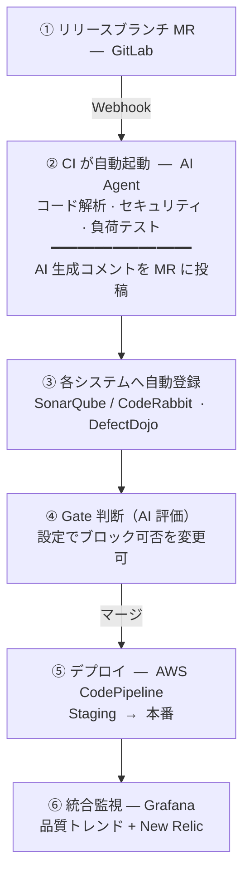
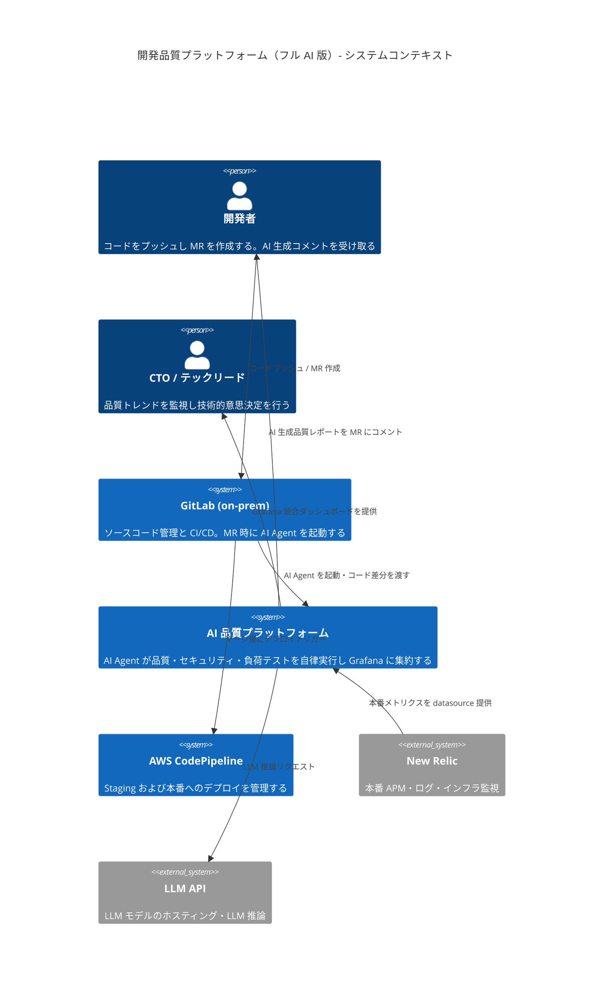
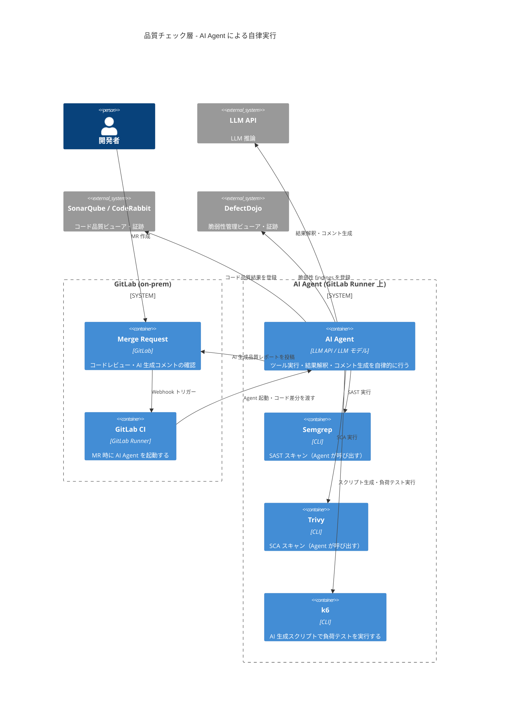
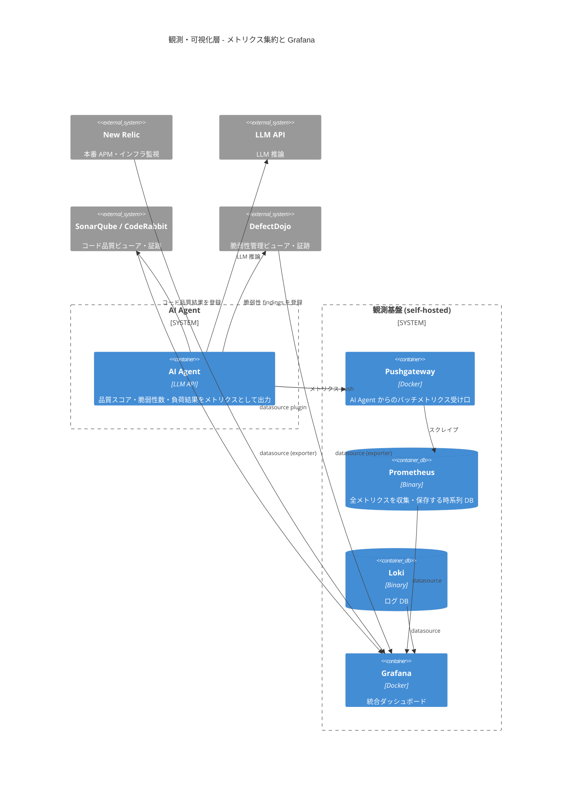
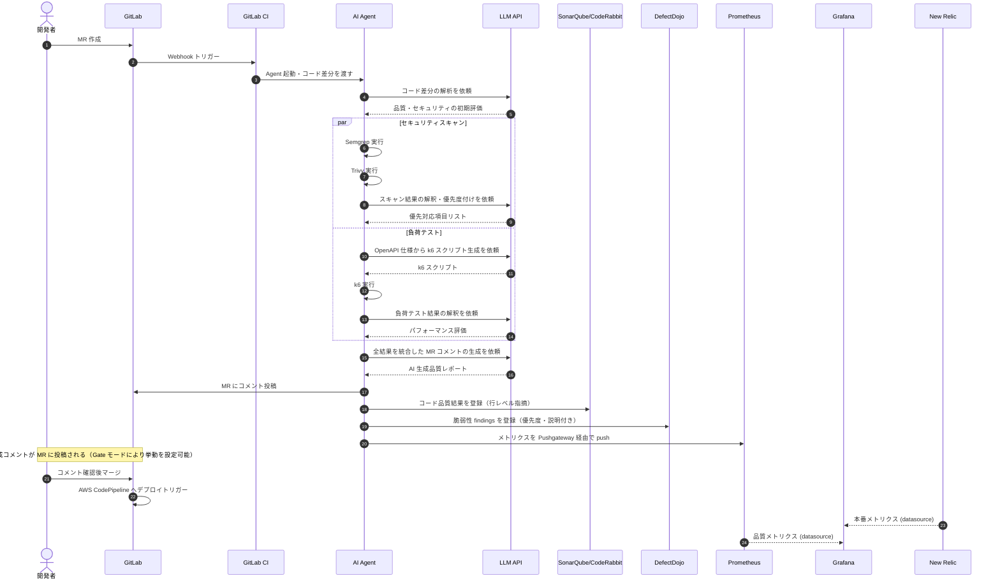

# 開発品質プラットフォーム構成案 — フル AI 版

---

## 要約

**AI Agent** を GitLab CI に組み込み、**リリースブランチへの MR 時**にコード解析・セキュリティスキャン・負荷テストの実行から結果の解釈・MR へのコメント投稿までを AI が自律的に行う構成。解析結果は **SonarQube（or CodeRabbit）/ DefectDojo に自動登録**し、ビューアとして継続活用する。

### コードが本番に届くまでのフロー



### 各ツールの担当領域

| 領域 | 実行 | ビューア / 証跡 |
|---|---|---|
| **コード品質** | AI Agent（diff 解析・Semgrep） | SonarQube / CodeRabbit |
| **セキュリティ** | AI Agent（Trivy を実行・解釈） | DefectDojo（優先度・履歴） |
| **負荷テスト** | AI Agent（スクリプト自動生成 + 結果解釈） | Grafana（Pushgateway 経由） |
| **本番監視** | — | New Relic → Grafana |
| **統合ビュー** | — | Grafana |

> **Gate をブロッキングにしない理由**: AI の判定精度が初期段階では不安定なため、まず通知フェーズでデータを蓄積する。精度が確認できた時点で Phase 3 以降でブロッキングへ移行する。

---

## 概要

### 背景

コード品質・セキュリティ・負荷テストの各チェック結果が分散しており、開発者が複数のツールを個別に確認しなければならない。スキャン結果の解釈・優先度付けも手動であり、対応漏れが発生しやすい。

**なぜ AI Agent か**: スキャンツール（Semgrep / Trivy / k6）はすでに存在するが、その出力は生の JSON であり、開発者が優先度を判断するには専門知識が必要。AI Agent はツールの実行・結果解釈・MR へのコメント生成を一括で行い、「何を直すべきか」を自然言語で説明できる。複数ツールのオーケストレーションも追加コードなしで実現できる点が、スクリプトや従来の CI ステップとの決定的な違い。

AI Agent を CI に組み込むことで、以下の課題を解決する。

- ツールの実行・結果解釈・MR コメントの**一連の流れを自動化**
- 脆弱性・品質問題を**コンテキストに応じた自然言語**で説明
- k6 スクリプトを OpenAPI 仕様から**自動生成**することで、テスト作成の工数を削減

### 目標

1. **品質フィードバックの統合**: ひとつの AI 生成コメントで品質・セキュリティ・負荷の結果を把握
2. **対応優先度の自動判定**: AI が重大度・修正難易度を考慮して優先項目を提示
3. **負荷テストの省力化**: OpenAPI 仕様から k6 スクリプトを自動生成
4. **段階的な自律化**: Phase 3 以降でブロッキングへ移行し、承認フローを自動化

### ビジネス価値

| 指標 | 改善内容 |
|---|---|
| **MR レビュー工数** | AI が実行・解釈をひとつのコメントに統合 |
| **脆弱性の優先度付け** | AI が自動判定し DefectDojo に登録（手動確認不要） |
| **k6 スクリプト作成** | OpenAPI から自動生成（数分）で手書き工数を削減 |
| **監査証跡** | SonarQube / DefectDojo に自動蓄積（担当者が登録不要） |

### コスト試算

#### LLM API 使用量（MR 1 件あたり）

| 処理 | 入力トークン | 出力トークン |
|---|---|---|
| コード差分の解析 | ~10K | ~2K |
| Semgrep 結果の解釈 | ~20K | ~1K |
| Trivy 結果の解釈 | ~30K | ~1K |
| k6 スクリプト生成 | ~5K | ~3K |
| k6 結果の解釈 | ~10K | ~2K |
| **合計** | **~75K** | **~9K** |

#### 月次コスト目安

| MR 件数/月 | API コスト |
|---|---|
| 50 件 | 約 $19/月 |
| 100 件 | 約 $38/月 |
| 300 件 | 約 $115/月 |
| 500 件 | 約 $191/月 |

> **現状の手動工数との比較**: 担当者がツールを個別実行・結果整形・DefectDojo / SonarQube 登録・MR コメント作成を手動で行う場合、リリース MR 1 件あたり 2〜4 時間を要する。月 50 件であれば 100〜200 時間 / 月の工数削減に相当し、エンジニアコストと比較して LLM API コスト（約 $19/月）は大幅に安価。

### オーナーシップ

| 役割 | 担当 |
|---|---|
| **AI Agent の構築・維持** | インフラ / DevOps チーム |
| **プロンプトの整備・改善** | インフラ / DevOps チーム + 各プロダクトリード |
| **GitLab CI 設定** | 各プロダクトチーム |
| **AI コメントの対応判断** | 各プロダクトチーム |

### 対象環境

| サービス | 役割 | 変更点 |
|---|---|---|
| **GitLab** (on-prem) | ソースコード管理・CI/CD | 変更なし |
| **LLM API** | LLM モデルのホスティング | 新規（従量課金） |
| **SonarQube / CodeRabbit** | コード品質ビューア・証跡 | 変更なし（既存活用） |
| **DefectDojo** | 脆弱性管理ビューア・証跡 | 変更なし（既存活用） |
| **観測基盤** (self-hosted) | Grafana / Prometheus / Loki | 変更なし |
| **AWS CodePipeline** | 本番デプロイ | 変更なし |
| **New Relic** | 本番監視 | 変更なし |

---

## C4 Level 1: システムコンテキスト図



---

## C4 Level 2: コンテナ図（品質チェック層）

AI Agent が MR 時に各ツールを自律的に呼び出し、結果を統合してコメントする。



---

## C4 Level 2: コンテナ図（観測・可視化層）

AI Agent がメトリクスを Pushgateway 経由で Prometheus に送信し、Grafana で可視化する。



---

## データフロー

MR 作成から AI コメント投稿・Grafana 反映までの時系列フロー。



---

## CI/CD Gate 設計

### Gate の判定基準

| Gate | 実行方法 | AI の役割 |
|---|---|---|
| **コード品質 Gate** | Agent が diff を解析 | バグ・設計上の問題を自然言語で説明 |
| **セキュリティ Gate** | Agent が Semgrep + Trivy を実行 | 脆弱性の影響範囲・修正方針を説明 |
| **負荷テスト Gate** | Agent が k6 スクリプトを生成・実行 | ボトルネックの原因と改善案を提示 |

### Gate 設定オプション（全案共通）

トリガー・Gate 挙動はいずれの案でも以下から選択可能。導入フェーズに応じた段階移行を推奨する。

| モード | 挙動 | 推奨フェーズ |
|---|---|---|
| **通知のみ** | 結果を MR にコメント。マージはブロックしない | Phase 1〜2（データ蓄積） |
| **自動ブロック** | しきい値超過で GitLab が MR を自動ブロック | Phase 3〜（しきい値安定後） |
| **機械的ブロック** | 登録済み findings の件数・重大度で自動判定してブロック | Human×AI 版での標準モード |

### GitLab CI テンプレート

```yaml
# .gitlab-ci.yml
stages:
  - ai-quality-gate

ai-gate:
  stage: ai-quality-gate
  image: python:3.12-slim
  before_script:
    - pip install anthropic click
    - apt-get install -y semgrep trivy k6
  script:
    - |
      python3 << 'EOF'
      import anthropic
      import subprocess
      import os

      client = anthropic.Anthropic(api_key=os.environ["ANTHROPIC_API_KEY"])
      diff = subprocess.check_output(["git", "diff", "origin/main...HEAD"]).decode()

      # Semgrep / Trivy 実行
      semgrep = subprocess.check_output(["semgrep", "--json", "."]).decode()
      trivy   = subprocess.check_output(["trivy", "fs", "--format", "json", "."]).decode()

      # AI Agent に全結果を渡して統合コメントを生成
      response = client.messages.create(
          model=os.environ["LLM_MODEL"],
          max_tokens=2000,
          messages=[{
              "role": "user",
              "content": f"""
      以下の情報をもとに、MR の品質レポートを日本語で作成してください。
      優先対応が必要な項目を3つ以内にまとめ、修正方針も提示してください。

      ## コード差分
      {diff[:5000]}

      ## Semgrep 結果
      {semgrep[:5000]}

      ## Trivy 結果
      {trivy[:5000]}
      """
          }]
      )

      comment = response.content[0].text
      # GitLab API でMRにコメント投稿
      import urllib.request, json
      data = json.dumps({"body": comment}).encode()
      req = urllib.request.Request(
          f"{os.environ['CI_API_V4_URL']}/projects/{os.environ['CI_PROJECT_ID']}/merge_requests/{os.environ['CI_MERGE_REQUEST_IID']}/notes",
          data=data,
          headers={"PRIVATE-TOKEN": os.environ["GITLAB_TOKEN"], "Content-Type": "application/json"}
      )
      urllib.request.urlopen(req)
      EOF
  rules:
    - if: $CI_PIPELINE_SOURCE == "merge_request_event"
```

### GitLab CI Variables

| Variable | 内容 |
|---|---|
| `LLM_API_KEY` | LLM API キー |
| `GITLAB_TOKEN` | MR コメント用 GitLab API トークン |

---

## 各ツールの役割と接続詳細

### AI Agent

| 項目 | 内容 |
|---|---|
| **役割** | 品質チェック全体のオーケストレーション・結果解釈 |
| **実行環境** | GitLab Runner（Docker コンテナ） |
| **使用モデル** | LLM モデル |
| **Grafana 連携** | 品質スコア・脆弱性数・p95 レイテンシを Pushgateway 経由で Prometheus へ push |

### Semgrep（Agent が呼び出す）

| 項目 | 内容 |
|---|---|
| **役割** | SAST スキャン（Agent の tool として実行） |
| **結果の扱い** | JSON を Agent が受け取り、LLM API で解釈・優先度付け |

### Trivy（Agent が呼び出す）

| 項目 | 内容 |
|---|---|
| **役割** | SCA スキャン（依存ライブラリの脆弱性） |
| **結果の扱い** | JSON を Agent が受け取り、LLM API で影響範囲・修正方針を生成 |

### k6（Agent が生成・実行）

| 項目 | 内容 |
|---|---|
| **役割** | 負荷テストの実行 |
| **スクリプト生成** | OpenAPI 仕様 または コード差分から AI が自動生成 |
| **結果の扱い** | Agent が解釈し、ボトルネックと改善案を MR にコメント |

### New Relic

| 項目 | 内容 |
|---|---|
| **役割** | 本番環境の APM・インフラ・エラー監視 |
| **変更点** | 変更なし |

---

## Grafana 統合ダッシュボード構成

```
Variable: product  → 全プロダクト共通のダッシュボードを使い回す

┌─────────────────────────────────────────────────────────────┐
│  [product: foo-api ▼]                          2026-03-15   │
├──────────────────┬──────────────────┬───────────────────────┤
│ AI 品質スコア     │ 脆弱性数          │ 負荷テスト             │
│ スコア: 82/100   │ Critical: 0      │ p95: 230ms            │
│ 指摘件数: 3      │ High: 2          │ RPS: 1,200            │
│ トレンド: ↑      │ トレンド: ↓      │ エラー率: 0.02%       │
├──────────────────┴──────────────────┴───────────────────────┤
│ 本番 (New Relic)                                            │
│ エラーレート: 0.01%   レイテンシ p95: 180ms   SLO: 99.95%  │
└─────────────────────────────────────────────────────────────┘
```

---

## 構築手順

### Step 1: LLM API キーの取得

利用する LLM サービスのコンソールでプロジェクトを作成し、API キーを発行する。
GitLab CI Variables に `LLM_API_KEY` として登録。

### Step 2: GitLab Runner の設定

AI Agent が使用する CLI ツールをインストールした Docker イメージを用意する。

```dockerfile
FROM python:3.12-slim
RUN apt-get update && apt-get install -y curl unzip git
RUN pip install anthropic
RUN curl -sSfL https://raw.githubusercontent.com/anchore/syft/main/install.sh | sh
# Trivy
RUN curl -sfL https://raw.githubusercontent.com/aquasecurity/trivy/main/contrib/install.sh | sh
# k6
RUN apt-get install -y gnupg && \
    gpg --no-default-keyring --keyring /usr/share/keyrings/k6-archive-keyring.gpg \
        --keyserver hkp://keyserver.ubuntu.com:80 --recv-keys C5AD17C747E3415A3642D57D77C6C491D6AC1D69 && \
    echo "deb [signed-by=/usr/share/keyrings/k6-archive-keyring.gpg] https://dl.k6.io/deb stable main" \
        | tee /etc/apt/sources.list.d/k6.list && \
    apt-get update && apt-get install k6
```

### Step 3: Pushgateway 導入

```yaml
services:
  pushgateway:
    image: prom/pushgateway:latest
    ports:
      - "9092:9091"
    restart: unless-stopped
```

### Step 4: GitLab CI テンプレートをプロジェクトに配置

前節の `.gitlab-ci.yml` を各プロダクトのリポジトリに追加。
`LLM_API_KEY` と `GITLAB_TOKEN` を GitLab CI Variables に設定するだけで動作する。

### Step 5: New Relic Datasource Plugin

`grafana-cli plugins install grafana-newrelic-datasource`

### Step 6: Grafana 統合ダッシュボード作成

Pushgateway から収集したメトリクス（`ai_quality_score`・`ai_vulnerability_count`・`k6_http_req_duration`）を Variable `product` でフィルタしてパネルを構成する。

---

## 導入ロードマップ

| フェーズ | 期間 | 内容 | マイルストーン |
|---|---|---|---|
| **Phase 1** | 1〜2 週 | AI Agent の基本セットアップ + Semgrep/Trivy 実行 | セキュリティレポートの MR コメント化 |
| **Phase 2** | 3〜4 週 | コード品質解析 + Pushgateway → Grafana | AI 品質スコアの可視化開始 |
| **Phase 3** | 5〜6 週 | k6 スクリプト自動生成 + 負荷テスト結果の解釈 | 負荷テストの省力化 |
| **Phase 4** | 7〜8 週 | 統合ダッシュボード + Grafana Alerting | 全プロダクト横断ダッシュボード完成 |
| **Phase 5** | 9 週〜 | AI 精度の評価 → ブロッキング Gate への移行 | Critical 脆弱性のみブロッキング化 |

---

## リスクと対策

| リスク | 影響度 | 対策 |
|---|---|---|
| **AI の判定精度が低い（誤検知）** | 高 | Phase 1〜2 は通知のみ。開発者のフィードバックでプロンプトを改善 |
| **LLM API のレート制限・障害** | 中 | API 障害時は CI をスキップ（品質チェックなしで続行可能）。SLA は 99.9% |
| **API コストの予想外の増加** | 中 | MR あたりのトークン上限を設定。月次コストアラートを Grafana に設定 |
| **プロンプトインジェクション** | 中 | コード差分をそのままプロンプトに含めるため、悪意あるコメントに注意。入力サニタイズを実施 |
| **AI コメントを開発者が無視する** | 高 | Phase 5 で Critical のみブロッキング化。AI コメントの有用性をチームで定期レビュー |
| **ベンダーロックイン（LLM ベンダー）** | 低 | AI Agent のインターフェースを抽象化し、モデルの差し替えを可能にする |

