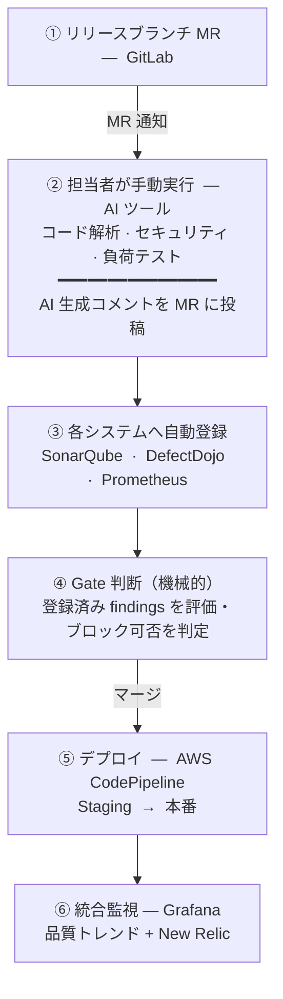
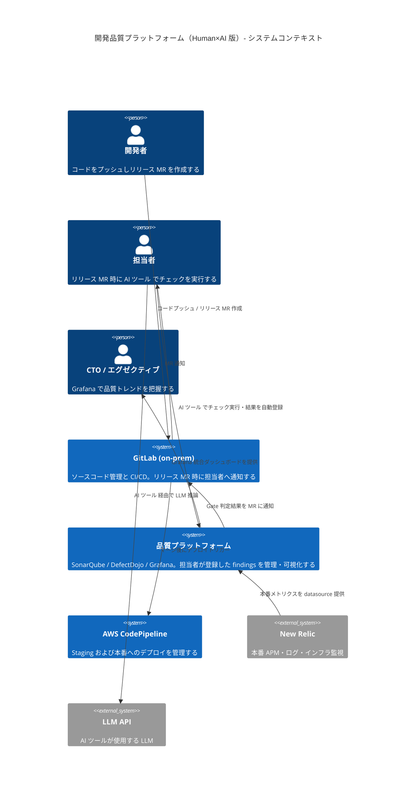
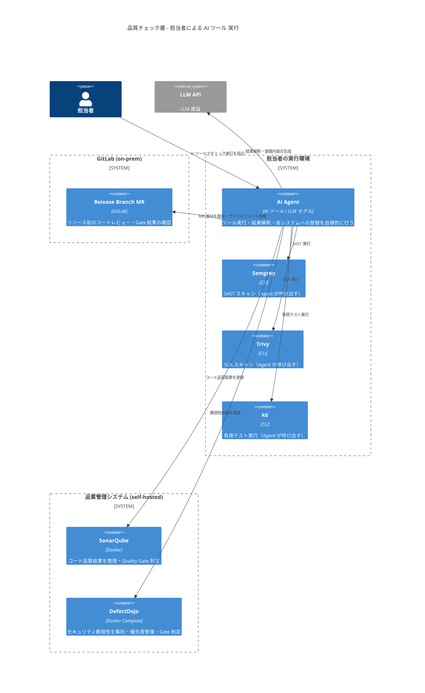
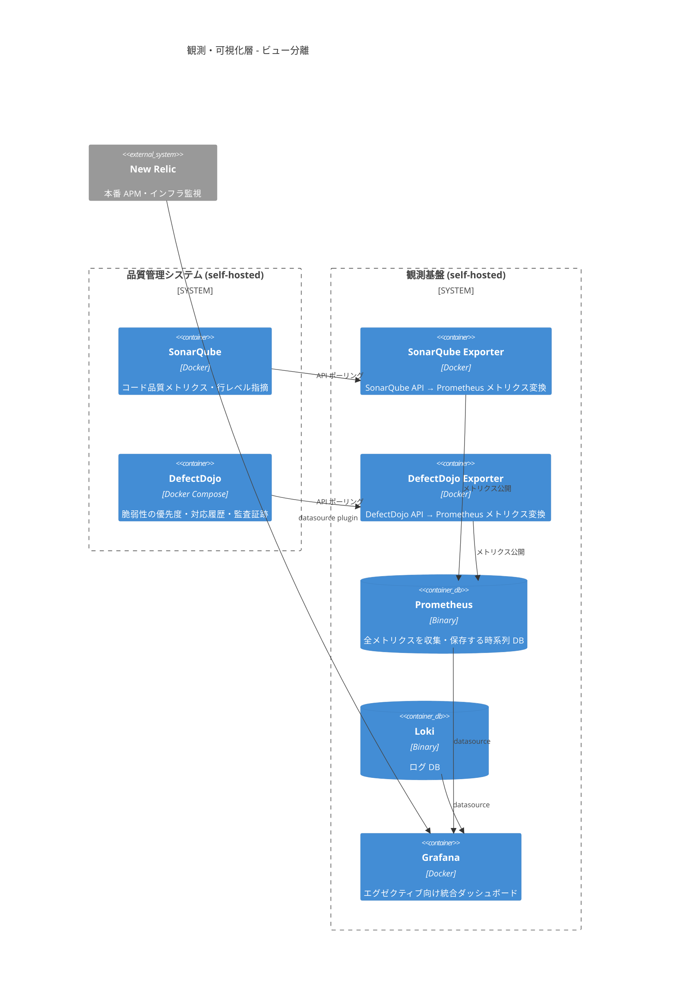
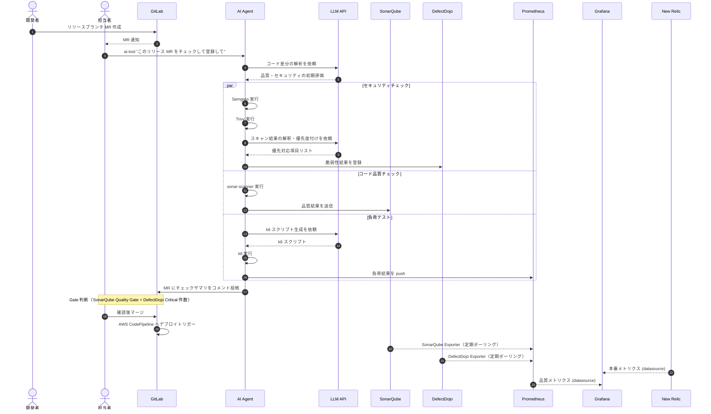

# 開発品質プラットフォーム構成案 — Human×AI 版

---

## 要約

**フル AI 版（自動化）への移行ステップとして位置づける構成案。** 開発チームが AI Agent の挙動をまだ信頼していない段階では、担当者が実行タイミングを制御しながら AI を活用する。**リリースブランチへの MR 作成時**に担当者が AI ツール でチェックを実行すると、AI Agent が各ツールを自律的に呼び出し、結果を SonarQube・DefectDojo・Prometheus に自動登録する。Gate 判断は登録済みデータを機械的に評価する。エグゼクティブは Grafana で概況を把握し、担当者は SonarQube・DefectDojo・Grafana で詳細を確認する。

### コードが本番に届くまでのフロー



### 各ツールの担当領域

| 領域 | ツール | 担当者の操作 |
|---|---|---|
| **コード品質** | AI Agent → SonarQube | CLI で指示するだけ |
| **セキュリティ** | AI Agent → DefectDojo (Semgrep / Trivy 集約) | CLI で指示するだけ |
| **負荷テスト** | AI Agent → k6 → Prometheus | CLI で指示するだけ |
| **本番監視** | New Relic | 変更なし |
| **統合ビュー** | Grafana | 変更なし |

> **Gate 設定オプション（全案共通）**: トリガー・Gate 挙動はいずれの案でも選択可能。

| モード | 挙動 | 推奨フェーズ |
|---|---|---|
| **通知のみ** | 結果を MR にコメント。マージはブロックしない | 導入初期（データ蓄積） |
| **自動ブロック** | しきい値超過で GitLab が MR を自動ブロック | しきい値安定後 |
| **機械的ブロック** | 登録済み findings の件数・重大度で自動判定してブロック | 本案での標準モード |

---

## 概要

### 背景

**なぜ AI Agent か**: スキャンツール（Semgrep / Trivy / k6）はすでに存在するが、その出力は生の JSON であり、担当者が優先度を判断するには専門知識が必要。AI Agent はツールの実行・解釈・SonarQube / DefectDojo への登録を 1 コマンドで代行し、担当者は「何を確認するか」の判断に集中できる。

フル自動化では CI が MR ごとにツールを実行するが、リリース前のチェックには以下の課題がある。

- リリース判断に値する深いチェック（本格的な負荷テスト等）は CI の自動実行には馴染まない
- ツールの生出力（ノイズが多い）をそのまま Gate に使うと誤検知が増える
- セキュリティ・品質の最終判断は担当者の文脈理解が必要な場合がある

担当者が AI ツール で実行を指示することで、ツール選択・結果整形・システム登録を AI が代行しつつ、**実行タイミングと登録判断は人間が握る**構成とする。

### 目標

1. **担当者の負荷軽減**: ツールの実行・結果整形・登録を AI Agent が代行
2. **Gate の信頼性向上**: 人間が意図して登録した findings を Gate の根拠とする
3. **ビューの分離**: エグゼクティブ（Grafana）と担当者（SonarQube・DefectDojo）で適切な粒度を提供
4. **既存ツールの活用**: SonarQube・DefectDojo はそのまま利用。新規サービス追加なし

### ビジネス価値

| 指標 | 現状（手動） | Human×AI 版 |
|---|---|---|
| **チェック実行工数** | ツールを個別に実行・結果を整形 | AI ツール 1コマンドで完結 |
| **各システムへの登録** | 手動でコピー・ペースト | AI Agent が自動登録 |
| **Gate の誤検知** | ツールの生出力をそのまま使用 | 担当者が確認した結果のみ登録 |
| **担当者のスキル依存** | 各ツールの使い方を習得が必要 | CLI で日本語指示するだけ |

### コスト試算

#### LLM API 使用量（リリース MR 1 件あたり）

| 処理 | 入力トークン | 出力トークン |
|---|---|---|
| コード差分の解析 | ~10K | ~2K |
| Semgrep 結果の解釈・DefectDojo 登録 | ~20K | ~2K |
| Trivy 結果の解釈・DefectDojo 登録 | ~30K | ~2K |
| k6 スクリプト生成・実行・結果登録 | ~15K | ~4K |
| **合計** | **~75K** | **~10K** |

#### 月次コスト目安

| リリース MR 件数/月 | API コスト |
|---|---|
| 10 件 | 約 $4/月 |
| 30 件 | 約 $11/月 |
| 50 件 | 約 $19/月 |

> リリースブランチへの MR に限定するため、フル AI 版と比較して API 使用量は大幅に少ない。
> **現状の手動工数との比較**: ツールの個別実行・結果整形・登録・MR コメント作成を手動で行う場合、リリース MR 1 件あたり 2〜4 時間を要する。月 10 件であれば 20〜40 時間 / 月の工数削減に相当し、LLM API コスト（約 $4/月）は投資対効果が非常に高い。

### オーナーシップ

| 役割 | 担当 |
|---|---|
| **AI ツール 環境の構築・維持** | インフラ / DevOps チーム |
| **SonarQube・DefectDojo の維持** | インフラ / DevOps チーム |
| **リリース MR 時のチェック実行** | 各プロダクトの品質担当者 |
| **Gate 判定基準の設定** | インフラ / DevOps チーム + プロダクトリード |

### 対象環境

| サービス | 役割 | 変更点 |
|---|---|---|
| **GitLab** (on-prem) | ソースコード管理・CI/CD | 変更なし |
| **LLM API** | LLM モデルのホスティング | 新規（従量課金・少量） |
| **SonarQube** (self-hosted) | コード品質管理・Gate 判定 | 変更なし |
| **DefectDojo** (self-hosted) | セキュリティ脆弱性管理・Gate 判定 | 変更なし |
| **観測基盤** (self-hosted) | Grafana / Prometheus / Loki | 変更なし |
| **AWS CodePipeline** | 本番デプロイ | 変更なし |
| **New Relic** | 本番監視 | 変更なし |

---

## C4 Level 1: システムコンテキスト図



---

## C4 Level 2: コンテナ図（品質チェック層）

担当者が AI ツール を実行すると、Agent がツールを自律的に呼び出し各システムへ登録する。



---

## C4 Level 2: コンテナ図（観測・可視化層）

登録された findings が Grafana に集約され、エグゼクティブ・担当者それぞれのビューを提供する。



---

## データフロー

リリース MR 通知から各システム登録・Grafana 反映までの時系列フロー。



---

## CI/CD Gate 設計

### Gate の判定基準

| Gate | 登録先 | 判定基準 |
|---|---|---|
| **品質 Gate** | SonarQube | Quality Gate ステータス（Pass / Fail） |
| **セキュリティ Gate** | DefectDojo | Critical 件数 = 0 かつ High 件数 ≤ しきい値 |
| **負荷 Gate** | Prometheus | p95 レイテンシ ≤ しきい値、エラーレート ≤ 1% |

### Gate 設定オプション（全案共通）

| モード | 挙動 | 推奨フェーズ |
|---|---|---|
| **通知のみ** | 結果を MR にコメント。マージはブロックしない | 導入初期（データ蓄積） |
| **自動ブロック** | しきい値超過で GitLab が MR を自動ブロック | しきい値安定後 |
| **機械的ブロック** | 登録済み findings の件数・重大度で自動判定してブロック | 本案での標準モード |

### AI ツール コマンド例

```bash
# セキュリティチェックのみ
ai-tool "このリポジトリのセキュリティチェックをして、結果を DefectDojo に登録して。プロジェクト名は foo-api"

# コード品質チェックのみ
ai-tool "SonarQube でコード品質チェックをして、結果を送信して"

# 負荷テスト
ai-tool "ステージング環境 https://staging.foo-api.example.com に対して負荷テストをして、結果を Prometheus に記録して"

# 全部まとめて（リリース前フルチェック）
ai-tool "リリース MR #123 のフルチェックをして。セキュリティ・品質・負荷テストを実行し、それぞれ DefectDojo・SonarQube・Prometheus に登録して"
```

---

## 各ツールの役割と接続詳細

### AI Agent（AI ツール）

| 項目 | 内容 |
|---|---|
| **役割** | 担当者の指示を受けてツール実行・結果登録を代行するオーケストレーター |
| **実行環境** | 担当者のローカル環境（AI ツール） |
| **使用モデル** | LLM モデル |
| **許可ツール** | Bash（Semgrep / Trivy / k6 / sonar-scanner 実行）、WebFetch（GitLab API / DefectDojo API） |

### SonarQube

| 項目 | 内容 |
|---|---|
| **役割** | コード品質の管理・Quality Gate 判定 |
| **登録方法** | AI Agent が sonar-scanner を実行し結果を送信 |
| **担当者ビュー** | SonarQube UI で行レベルの指摘・技術的負債を確認 |
| **Grafana 連携** | SonarQube Exporter → Prometheus → Grafana |

### DefectDojo

| 項目 | 内容 |
|---|---|
| **役割** | セキュリティ脆弱性の集約・優先度管理・監査証跡 |
| **登録方法** | AI Agent が Semgrep / Trivy を実行し REST API でインポート |
| **担当者ビュー** | DefectDojo UI で脆弱性の優先度・対応履歴を確認 |
| **Grafana 連携** | DefectDojo Exporter → Prometheus → Grafana |

### k6

| 項目 | 内容 |
|---|---|
| **役割** | ステージング環境への負荷テスト |
| **スクリプト生成** | AI Agent が API 仕様・コード差分から自動生成 |
| **Grafana 連携** | Prometheus Remote Write → Grafana |

### New Relic

| 項目 | 内容 |
|---|---|
| **役割** | 本番環境の APM・インフラ・エラー監視 |
| **変更点** | 変更なし |

---

## Grafana ダッシュボード構成

```
エグゼクティブ向けビュー（高抽象度）
┌─────────────────────────────────────────────────────────────┐
│  [product: foo-api ▼]                          2026-03-15   │
├──────────────────┬──────────────────┬───────────────────────┤
│ 品質スコア        │ セキュリティ      │ 負荷テスト             │
│ Gate: PASS       │ Critical: 0      │ p95: 230ms            │
│ バグ数: 3        │ High: 2          │ RPS: 1,200            │
│ カバレッジ: 82%  │ 未対応: 2        │ エラー率: 0.02%       │
├──────────────────┴──────────────────┴───────────────────────┤
│ 本番 (New Relic)                                            │
│ エラーレート: 0.01%   レイテンシ p95: 180ms   SLO: 99.95%  │
└─────────────────────────────────────────────────────────────┘

担当者向けビュー（詳細）
  SonarQube  → 行レベルの指摘・技術的負債・カバレッジ詳細
  DefectDojo → 脆弱性一覧・優先度・対応履歴・担当者割り当て
  Grafana    → k6 負荷テスト詳細・時系列メトリクス
```

---

## 構築手順

### Step 1: AI ツール のセットアップ

```bash
# AI ツールをインストール（使用する LLM サービスに応じて手順が異なる）
# 例: npm install -g <ai-tool>

# API キーを設定
export LLM_API_KEY=<your-api-key>

# 動作確認
ai-tool --version
```

### Step 2: AI ツール に各ツールへのアクセスを許可

```bash
# ~/.ai-tool/settings.json（使用する AI ツールの設定ファイル）
{
  "allowedTools": ["Bash", "WebFetch", "Read", "Grep"],
  "env": {
    "SONAR_URL": "http://sonarqube.example.com",
    "DEFECTDOJO_URL": "http://defectdojo.example.com",
    "DEFECTDOJO_TOKEN": "<token>",
    "PROMETHEUS_PUSHGATEWAY_URL": "http://pushgateway.example.com:9092"
  }
}
```

### Step 3: AI ツール設定ファイルでプロジェクト固有の設定を記述

各プロダクトのリポジトリに設定ファイルを配置し、チェック対象・登録先を明示する。

```markdown
# Quality Check Instructions

## SonarQube
- Project Key: foo-api
- URL: $SONAR_URL

## DefectDojo
- Product Name: foo-api
- Engagement: release-check
- URL: $DEFECTDOJO_URL

## k6
- Target: https://staging.foo-api.example.com
- Duration: 5m
- VUs: 50
```

### Step 4: SonarQube Exporter・DefectDojo Exporter の設定

```bash
# SonarQube Exporter
docker run -d \
  -e SONARQUBE_URL=http://sonarqube.example.com \
  -e SONARQUBE_TOKEN=<token> \
  -p 9347:9347 \
  dmpe/sonarqube-exporter

# DefectDojo Exporter（Pushgateway 経由）
# AI Agent が登録時に Prometheus メトリクスも push する
```

### Step 5: Grafana 統合ダッシュボード作成

SonarQube・DefectDojo・k6・New Relic の各 datasource を `product` 変数でフィルタして統合表示。

---

## 導入ロードマップ

| フェーズ | 期間 | 内容 | マイルストーン |
|---|---|---|---|
| **Phase 1** | 1 週 | AI ツール セットアップ + セキュリティチェック（DefectDojo 登録） | CLI 1コマンドでDefectDojo登録 |
| **Phase 2** | 2〜3 週 | コード品質チェック（SonarQube 連携） + Grafana | 担当者ビュー完成 |
| **Phase 3** | 3〜4 週 | k6 負荷テスト自動生成・登録 | 全チェックの CLI 化完了 |
| **Phase 4** | 5〜6 週 | エグゼクティブ向け Grafana ダッシュボード整備 | 全ビュー完成 |
| **Phase 5** | 7 週〜 | Gate のブロッキング化（Critical = 0 を必須条件に） | 機械的ブロック Gate 稼働 |

---

## リスクと対策

| リスク | 影響度 | 対策 |
|---|---|---|
| **担当者がチェックを実行し忘れる** | 高 | GitLab の MR ルールで「チェック実行済み」ラベルを必須化 |
| **AI ツール の結果が登録されない** | 中 | Agent の実行ログを Loki に送信し、未登録を Grafana Alerting で検知 |
| **LLM API 障害** | 中 | 手動でツールを実行し直接登録するフォールバック手順を整備 |
| **担当者ごとにチェック粒度がバラつく** | 中 | 設定ファイルでチェック内容を標準化。プロンプトをテンプレート化 |
| **API コストの予想外の増加** | 低 | リリース MR に限定するため頻度は低い。月次コストをモニタリング |

---

## 付録: 2案の比較

詳細な比較は `03_quality-platform-comparison.md` を参照。

### 本案を選ぶ判断基準

- リリース前の深いチェックに**担当者の文脈理解**が必要な場合
- 既存の SonarQube・DefectDojo 資産を活かしたい場合
- Gate の根拠として**人間が確認した findings** を使いたい場合
- チームが小さく、CI での常時自動実行が過剰に感じる場合
