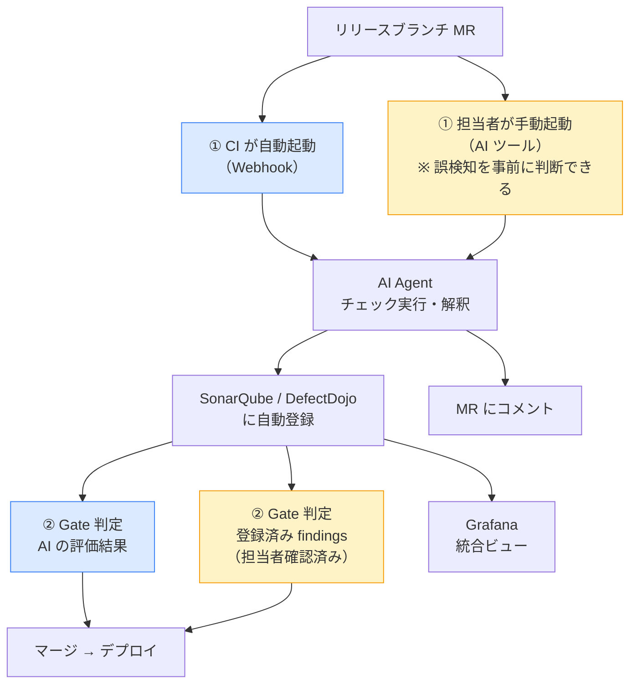
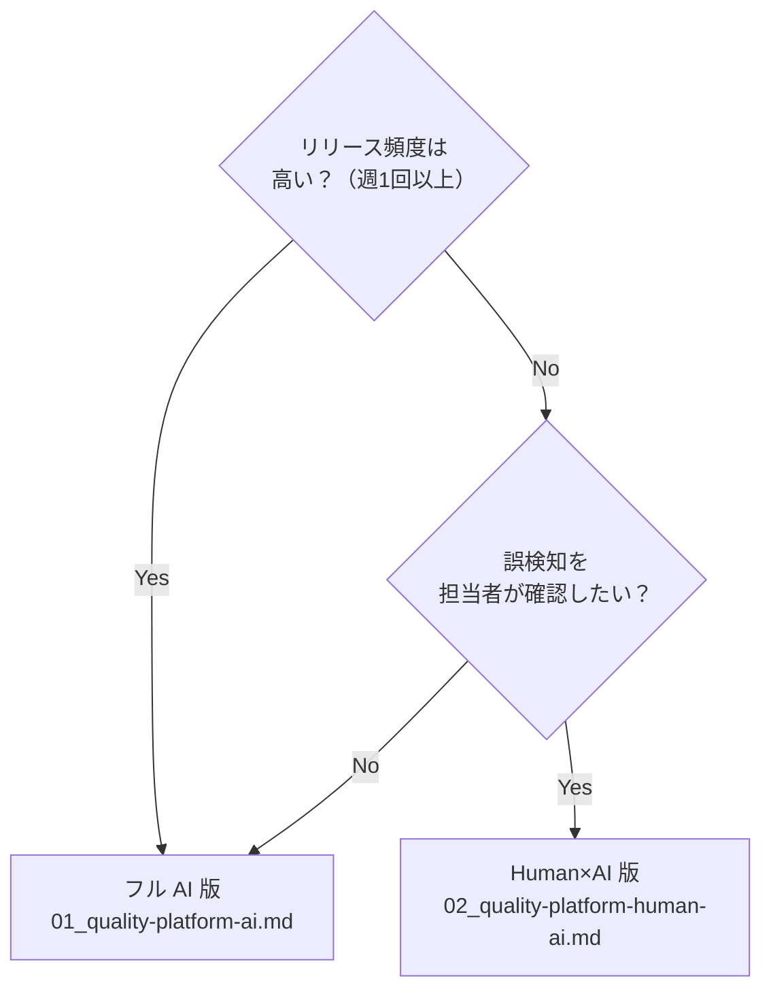

# 開発品質プラットフォーム 構成案比較

---

## 2案の違い

両案とも **AI Agent が SonarQube / DefectDojo に結果を自動登録**する点は共通。違いは **① トリガー** と **② Gate の根拠** の2点のみ。



| | フル AI 版 | Human×AI 版 |
|---|---|---|
| **実行タイミング** | GitLab CI が自動実行 | 担当者が AI ツール で手動実行 |
| **SonarQube / DefectDojo** | Agent が自動登録 | Agent が自動登録 |
| **誤検知対策** | AI がフィルタリング | 担当者が確認してから実行 |
| **Gate の根拠** | AI の評価結果 | 担当者が確認した登録済み findings |
| **詳細文書** | `01_quality-platform-ai.md` | `02_quality-platform-human-ai.md` |

---

## トリガーと Gate オプション（全案共通）

### トリガー

| オプション | 説明 |
|---|---|
| **リリースブランチ MR**（推奨） | `main → release` など本番リリース前の MR 時のみ実行 |
| **全 MR** | すべての MR 時に実行。開発速度とのトレードオフあり |

### Gate 設定オプション

| モード | 挙動 | 推奨タイミング |
|---|---|---|
| **通知のみ** | 結果を MR にコメント。ブロックしない | 導入初期・データ蓄積フェーズ |
| **自動ブロック** | しきい値超過で GitLab が MR を自動ブロック | しきい値が安定した段階 |
| **機械的ブロック** | 登録済み findings を機械的に評価してブロック | Human×AI 版での標準モード |

---

## 詳細比較

### チェック実行と結果管理

| 観点 | フル AI 版 | Human×AI 版 |
|---|---|---|
| **コード品質** | CI トリガー → AI → SonarQube 登録 | 手動トリガー → AI → SonarQube 登録 |
| **セキュリティ** | CI トリガー → AI → DefectDojo 登録 | 手動トリガー → AI → DefectDojo 登録 |
| **負荷テスト** | AI がスクリプト生成・解釈 → Grafana | AI がスクリプト生成・解釈 → Grafana |
| **監査証跡** | SonarQube + DefectDojo に蓄積 | SonarQube + DefectDojo に蓄積 |
| **誤検知対策** | AI がフィルタリング（担当者確認なし） | 担当者が確認してから実行 |

### ビュー（誰が何で確認するか）

| 対象者 | 両案共通 |
|---|---|
| **エグゼクティブ** | Grafana（概況） |
| **品質担当** | SonarQube / CodeRabbit + Grafana |
| **セキュリティ担当** | DefectDojo + Grafana |
| **開発者** | MR コメント（AI 説明） |

### コスト

| 観点 | フル AI 版 | Human×AI 版 |
|---|---|---|
| **新規ライセンス費用** | LLM API（従量） | LLM API（従量・少量） |
| **月次 API コスト目安** | $20〜200/月（MR 数による） | $4〜20/月（リリース頻度による） |
| **初期構築工数** | 1〜2 週 | 1 週 |
| **継続的な運用工数** | プロンプトの改善 | 設定ファイルの整備 |
| **SonarQube / DefectDojo** | 必要（既存活用・ビューア） | 必要（既存活用・ビューア） |

### リスクプロファイル

| リスク | フル AI 版 | Human×AI 版 |
|---|---|---|
| **AI 判定精度への依存** | 高（担当者確認なし） | 低（担当者が実行前に判断） |
| **誤検知** | 中（AI がフィルタ） | 低（担当者が確認後に実行） |
| **チェック漏れ** | 低（自動実行） | 中（手動トリガー） |
| **監査対応** | 強（SonarQube / DefectDojo に証跡） | 強（SonarQube / DefectDojo に証跡） |
| **スケーラビリティ** | 高 | 低（担当者がボトルネック） |

---

## ユースケース別推奨

両案とも SonarQube / DefectDojo に証跡が残るため、監査対応は共通で可能。選択の軸は「リリース頻度」と「誤検知リスクの許容度」。



---

## 移行パス

インフラは共通。チームが AI に慣れた時点でいつでも切り替えられる。

```
Phase 1（1〜2ヶ月）: Human×AI 版
  └─ 担当者が AI ツールで手動チェック・SonarQube / DefectDojo に登録
  └─ "AI が何をしてくれるか" をチーム全体が体験する期間
  └─ Grafana でエグゼクティブビューを整備

Phase 2（3ヶ月目〜）: フル AI 版へ切り替え
  └─ GitLab CI に AI Agent を組み込み、手動実行を廃止
  └─ 担当者は AI コメントの確認と最終判断に専念
  └─ SonarQube / DefectDojo への登録は継続（インフラ変更なし）

Phase 3（6ヶ月目〜）: 自律化
  └─ Critical 脆弱性のみブロッキング Gate を有効化
  └─ AI の精度向上に合わせて Gate 範囲を拡大
```

---

## 推奨

> **戦略的ゴールはフル AI 版。Human×AI 版はそこへの移行ステップ。**
>
> | | |
> |---|---|
> | **目指す姿** | フル AI 版：CI が自律的に品質保証を完結。人間はビジネスロジックに集中 |
> | **現実的な出発点** | Human×AI 版：AI に慣れていない担当者でも手動で始められる。ツール・インフラは同一 |
> | **移行トリガー** | チームが AI Agent の挙動を信頼できるようになった時点でフル AI 版へ切り替え |
>
> 開発チームの AI リテラシーが追いついていない現状では、Human×AI 版で「AI が何をしてくれるか」を体験させることが最速の移行経路。インフラは共通なので切り替えコストはゼロ。

---

## 構成案サマリ

### フル AI 版（`01_quality-platform-ai.md`）⭐ 戦略的ゴール

GitLab CI が AI Agent を自動起動。Agent がツール実行・結果解釈・MR コメント投稿・SonarQube / DefectDojo への登録まで自律的に処理。LLM API 従量課金が発生。

**目指す姿**: 人間が品質チェックのオペレーションから解放され、ビジネスロジックの開発に集中できる状態。

---

### Human×AI 版（`02_quality-platform-human-ai.md`）— 移行ステップ

担当者が AI ツール でリリース前チェックを手動実行。Agent がツール実行・SonarQube / DefectDojo への自動登録を代行。AI に不慣れなチームがフル AI 版へ移行するまでの橋渡し。

**役割**: チームが「AI が何をしてくれるか」を体験し、フル AI 版へ移行するための学習フェーズ。
